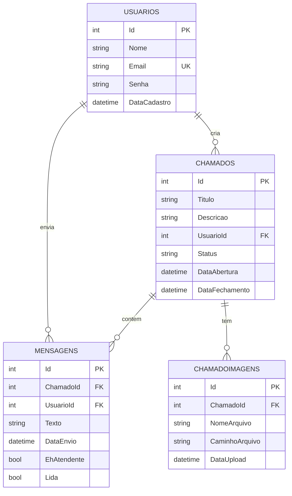

# 🎫 Sistema de Chamados - API REST

API desenvolvida em **ASP.NET Core 8.0** para gerenciamento de chamados de suporte técnico, integrada com aplicativo Android.

---

## 📋 Índice

- [Sobre o Projeto](#sobre-o-projeto)
- [Tecnologias](#tecnologias)
- [Pré-requisitos](#pré-requisitos)
- [Instalação](#instalação)
- [Configuração](#configuração)
- [Executando a API](#executando-a-api)
- [Endpoints](#endpoints)
- [Estrutura do Projeto](#estrutura-do-projeto)
- [Banco de Dados](#banco-de-dados)
- [Integração com Android](#integração-com-android)

---

## 🚀 Sobre o Projeto

Sistema completo de gestão de chamados que permite:

- ✅ Cadastro e autenticação de usuários
- ✅ Criação, edição e exclusão de chamados
- ✅ Sistema de chat por chamado
- ✅ Upload de imagens anexadas aos chamados
- ✅ Controle de status (Aberto, Em Andamento, Resolvido)
- ✅ Perfil de usuário com estatísticas

---

## 🛠 Tecnologias

- **ASP.NET Core 8.0**
- **Entity Framework Core 9.0.9**
- **SQL Server / SQL Server Express**
- **Swagger/OpenAPI** (documentação interativa)
- **JWT** (autenticação - preparado para implementação)

### Pacotes NuGet

```xml
<PackageReference Include="Microsoft.EntityFrameworkCore.SqlServer" Version="9.0.9" />
<PackageReference Include="Microsoft.EntityFrameworkCore.Tools" Version="9.0.9" />
<PackageReference Include="Swashbuckle.AspNetCore" Version="6.6.2" />
<PackageReference Include="System.IdentityModel.Tokens.Jwt" Version="8.14.0" />
```

---

## 📦 Pré-requisitos

- [.NET 8.0 SDK](https://dotnet.microsoft.com/download)
- [SQL Server](https://www.microsoft.com/sql-server/sql-server-downloads) ou SQL Server Express
- [Visual Studio 2022](https://visualstudio.microsoft.com/) (recomendado) ou Visual Studio Code

---

## 🔧 Instalação

### 1. Clone o repositório

```bash
git clone https://github.com/seu-usuario/sistema-chamados.git
cd sistema-chamados/ChamadosApi
```

### 2. Restaure os pacotes

```bash
dotnet restore
```

### 3. Configure o banco de dados

Edite o arquivo `appsettings.json` com sua connection string:

```json
{
  "ConnectionStrings": {
    "DefaultConnection": "Server=(local)\\SQLEXPRESS;Database=SistemaChamados;Trusted_Connection=true;TrustServerCertificate=true;"
  }
}
```

### 4. Execute as migrations

```bash
dotnet ef database update
```

Isso criará automaticamente:
- Tabela `Usuarios`
- Tabela `Chamados`
- Tabela `Mensagens`
- Tabela `ChamadoImagens`

---

## ⚙️ Configuração

### appsettings.json

Crie um arquivo `appsettings.json` baseado no `appsettings.Example.json`:

```json
{
  "ConnectionStrings": {
    "DefaultConnection": "SUA_CONNECTION_STRING_AQUI"
  },
  "Jwt": {
    "Key": "SuaChaveSecreta_MinimoDe32Caracteres!",
    "Issuer": "ChamadosApi",
    "Audience": "ChamadosApp"
  },
  "Logging": {
    "LogLevel": {
      "Default": "Information",
      "Microsoft.AspNetCore": "Warning"
    }
  },
  "AllowedHosts": "*"
}
```

⚠️ **IMPORTANTE**: Nunca commite o `appsettings.json` com dados sensíveis!

---

## ▶️ Executando a API

### Via Visual Studio
1. Abra a solução `ChamadosApi.sln`
2. Configure o projeto como startup
3. Pressione `F5` ou clique em "Run"

### Via linha de comando

```bash
dotnet run
```

A API estará disponível em:
- **HTTP**: `http://localhost:5257`
- **HTTPS**: `https://localhost:7279`
- **Swagger**: `http://localhost:5257/swagger`

---

## 📡 Endpoints

### 🔐 Autenticação

#### POST `/api/auth/login`
Realiza login do usuário.

**Request Body:**
```json
{
  "email": "usuario@email.com",
  "senha": "senha123"
}
```

**Response:**
```json
{
  "success": true,
  "message": "Login realizado com sucesso",
  "user": {
    "id": 1,
    "nome": "João Silva",
    "email": "usuario@email.com",
    "dataCadastro": "2024-01-15T10:30:00"
  }
}
```

#### POST `/api/auth/register`
Cadastra novo usuário.

**Request Body:**
```json
{
  "nome": "João Silva",
  "email": "usuario@email.com",
  "senha": "senha123"
}
```

---

### 🎫 Chamados

#### GET `/api/chamados/usuario/{usuarioId}`
Lista todos os chamados de um usuário.

#### POST `/api/chamados`
Cria novo chamado.

**Request Body:**
```json
{
  "titulo": "Problema com impressora",
  "descricao": "A impressora não está funcionando",
  "usuarioId": 1
}
```

#### GET `/api/chamados/{id}`
Busca chamado por ID.

#### PUT `/api/chamados/{id}`
Atualiza chamado existente.

#### DELETE `/api/chamados/{id}`
Deleta chamado.

---

### 💬 Mensagens (Chat)

#### GET `/api/mensagens/chamado/{chamadoId}`
Lista mensagens de um chamado.

#### POST `/api/mensagens`
Envia nova mensagem.

**Request Body:**
```json
{
  "chamadoId": 1,
  "usuarioId": 1,
  "texto": "Mensagem de teste",
  "ehAtendente": false
}
```

#### PUT `/api/mensagens/{id}/ler`
Marca mensagem como lida.

#### GET `/api/mensagens/chamado/{chamadoId}/nao-lidas`
Lista mensagens não lidas.

---

### 🖼️ Imagens

#### POST `/api/imagens/upload`
Faz upload de imagem para um chamado.

**Request (multipart/form-data):**
- `ChamadoId`: int
- `Arquivo`: file

#### GET `/api/imagens/chamado/{chamadoId}`
Lista imagens de um chamado.

#### DELETE `/api/imagens/{id}`
Deleta imagem.

---

### 👤 Usuário

#### GET `/api/usuario/perfil/{usuarioId}`
Busca perfil do usuário com estatísticas.

#### PUT `/api/usuario/perfil/{usuarioId}`
Atualiza dados do perfil.

**Request Body:**
```json
{
  "nome": "João Silva",
  "email": "novo@email.com",
  "senhaAtual": "senha123",
  "novaSenha": "novaSenha123"
}
```

---

## 📁 Estrutura do Projeto

```
ChamadosApi/
├── Controllers/
│   ├── AuthController.cs          # Autenticação
│   ├── ChamadosController.cs      # CRUD de chamados
│   ├── ImagensController.cs       # Upload de imagens
│   ├── MensagensController.cs     # Sistema de chat
│   └── UsuarioController.cs       # Perfil do usuário
├── Data/
│   └── ApplicationDbContext.cs    # Contexto do EF Core
├── Migrations/
│   ├── 20251029022433_AddMensagensTable.cs
│   └── 20251102224352_AddChamadoImagensTable.cs
├── Models/
│   ├── Chamado.cs                 # Entidade Chamado
│   ├── ChamadoImagem.cs          # Entidade Imagem
│   ├── Mensagem.cs               # Entidade Mensagem
│   ├── Usuario.cs                # Entidade Usuário
│   ├── UsuarioPerfil.cs          # DTO Perfil
│   └── FCMTokenRequest.cs        # Firebase (preparado)
├── Properties/
│   └── launchSettings.json
├── wwwroot/
│   └── uploads/                   # Pasta de imagens
├── appsettings.json              # Configurações (não commitado)
├── appsettings.Example.json      # Template de configuração
├── Program.cs                    # Entry point
└── ChamadosApi.csproj           # Arquivo de projeto
```

---

## 🗄️ Banco de Dados

### Modelo de Dados



### Scripts SQL

#### Criar usuário de teste

```sql
INSERT INTO Usuarios (Nome, Email, Senha, DataCadastro)
VALUES ('Admin', 'admin@email.com', '12345678', GETDATE());
```

#### Consultar estatísticas

```sql
SELECT 
    u.Nome,
    COUNT(c.Id) as TotalChamados,
    SUM(CASE WHEN c.Status = 'Aberto' THEN 1 ELSE 0 END) as Abertos,
    SUM(CASE WHEN c.Status = 'Resolvido' THEN 1 ELSE 0 END) as Resolvidos
FROM Usuarios u
LEFT JOIN Chamados c ON u.Id = c.UsuarioId
GROUP BY u.Nome;
```

---

## 📱 Integração com Android

### Configuração do Android

No arquivo `ApiClient.java` do app Android:

```java
private static final String BASE_URL = "http://10.0.2.2:5257/api/";
```

⚠️ **Nota**: `10.0.2.2` é o IP para acessar localhost do emulador Android.

### CORS

A API já está configurada para aceitar requisições do Android:

```csharp
app.UseCors("AllowAll");
```

Origins permitidas:
- `http://10.0.2.2` (Emulador)
- `http://localhost`
- `http://127.0.0.1`

---

## 🔒 Segurança

### ⚠️ Implementações Necessárias

Esta é uma versão de desenvolvimento. Para produção, implemente:

1. **Hash de Senhas**
   - Use BCrypt ou Argon2
   - Nunca armazene senhas em texto plano

2. **Autenticação JWT**
   - Token já configurado
   - Implementar geração e validação

3. **HTTPS Obrigatório**
   - Desabilitar HTTP em produção

4. **Rate Limiting**
   - Evitar ataques de força bruta

5. **Validação de Inputs**
   - Sanitização de dados
   - Validação de tipos de arquivo

---

## 🐛 Resolução de Problemas

### Erro: "A connection was successfully established..."

**Solução**: Verifique se o SQL Server está rodando:
```bash
services.msc
# Procure por "SQL Server (SQLEXPRESS)" e inicie
```

### Erro: "Unable to connect to web server 'ChamadosApi'"

**Solução**: Limpe e reconstrua o projeto:
```bash
dotnet clean
dotnet build
```

### Erro 500 em endpoints

**Solução**: Verifique os logs no console ou Output do Visual Studio.

---

## 📝 Licença

Este projeto foi desenvolvido como trabalho acadêmico.

---

## 👥 Autores

- **Seu Nome** - Desenvolvimento Full Stack

---

## 📞 Suporte

Para dúvidas ou problemas:
- Abra uma **Issue** no GitHub
- Entre em contato via email

---

## 🚀 Próximas Implementações

- [ ] Autenticação JWT completa
- [ ] Hash de senhas (BCrypt)
- [ ] Notificações Push (Firebase)
- [ ] Sistema de permissões (Admin/User)
- [ ] Dashboard administrativo
- [ ] Exportação de relatórios
- [ ] Backup automático do banco

---

**Desenvolvido com ❤️ usando ASP.NET Core e Android**