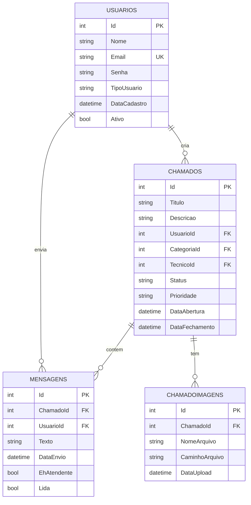

# 🎫 Sistema de Chamados - Suporte Técnico

Sistema completo de gestão de chamados de suporte técnico desenvolvido como projeto acadêmico, composto por **4 plataformas integradas**: Web, Desktop, API REST e Mobile.

---

## 📋 Índice

- [Sobre o Projeto](#sobre-o-projeto)
- [Arquitetura do Sistema](#arquitetura-do-sistema)
- [Tecnologias Utilizadas](#tecnologias-utilizadas)
- [Funcionalidades](#funcionalidades)
- [Estrutura do Repositório](#estrutura-do-repositório)
- [Pré-requisitos](#pré-requisitos)
- [Instalação e Configuração](#instalação-e-configuração)
- [Como Executar](#como-executar)
- [Documentação por Plataforma](#documentação-por-plataforma)
- [Equipe](#equipe)

---

## 🚀 Sobre o Projeto

O **Sistema de Chamados** é uma solução completa para gerenciamento de tickets de suporte técnico, permitindo que usuários abram chamados, acompanhem o progresso, conversem com técnicos via chat e anexem imagens aos problemas.

### 🎯 Objetivos

- Centralizar o atendimento de suporte técnico
- Facilitar a comunicação entre usuários e técnicos
- Proporcionar múltiplas plataformas de acesso
- Organizar e priorizar chamados de forma eficiente

---

## 🏗️ Arquitetura do Sistema

```
┌─────────────────────────────────────────────────────────┐
│              BANCO DE DADOS SQL SERVER                  │
│         Database: SistemaChamadosUnificado              │
└───────────────────┬─────────────────────────────────────┘
                    │
                    │ (Conexão centralizada via API REST)
                    │
         ┌──────────┴──────────┐
         │      API REST       │
         │   ASP.NET Core 8.0  │
         │   (Backend Central) │
         └──────────┬──────────┘
                    │
    ┌───────────────┼───────────────┬───────────────┐
    │               │               │               │
    ▼               ▼               ▼               ▼
┌─────────┐   ┌──────────┐   ┌──────────┐   ┌──────────┐
│   WEB   │   │ DESKTOP  │   │  MOBILE  │   │  ADMIN   │
│   MVC   │   │  WinForms│   │ Android  │   │   WEB    │
│         │   │          │   │          │   │          │
│ Usuários│   │ Técnicos │   │Usuários  │   │Gerentes  │
└─────────┘   └──────────┘   └──────────┘   └──────────┘
```

### 📱 Plataformas do Sistema

| Plataforma | Tecnologia | Usuários | Status |
|------------|-----------|----------|--------|
| **API REST** | ASP.NET Core 8.0 | Backend | ✅ Implementado |
| **Mobile** | Android (Java) | Usuários Finais | ✅ Implementado |
| **Web MVC** | ASP.NET Core MVC | Usuários/Admin | 🔄 Em Integração |
| **Desktop** | Windows Forms | Técnicos | 🔄 Em Integração |

---

## 🛠 Tecnologias Utilizadas

### Backend (API REST)
- **ASP.NET Core 8.0**
- **Entity Framework Core 9.0**
- **SQL Server / SQL Server Express**
- **Swagger/OpenAPI** - Documentação
- **JWT** - Autenticação (preparado)

### Mobile (Android)
- **Java** - Linguagem principal
- **Android SDK 34** (API Level 24+)
- **Retrofit 2.9.0** - Comunicação HTTP
- **Glide 4.16.0** - Carregamento de imagens
- **Material Design 3** - Interface
- **Google Gemini AI** - Assistente virtual

### Web (MVC)
- **ASP.NET Core MVC**
- **Bootstrap 5**
- **Entity Framework Core**

### Desktop (Windows Forms)
- **.NET 8.0**
- **Windows Forms**
- **HttpClient** - Comunicação com API

### Banco de Dados
- **SQL Server 2019+** ou **SQL Server Express**
- **Entity Framework Core Migrations**

---

## ✨ Funcionalidades

### 👤 Para Usuários

- ✅ Cadastro e autenticação
- ✅ Criar, editar e excluir chamados
- ✅ Acompanhar status dos chamados
- ✅ Chat em tempo real com técnicos
- ✅ Anexar imagens aos chamados
- ✅ Visualizar histórico de chamados
- ✅ Assistente IA (Gemini) para suporte
- ✅ Notificações push (preparado)
- ✅ Perfil com estatísticas

### 🔧 Para Técnicos

- ✅ Visualizar todos os chamados
- ✅ Filtrar por status e prioridade
- ✅ Atribuir chamados para si
- ✅ Responder via chat
- ✅ Alterar status dos chamados
- ✅ Visualizar imagens anexadas

### 👨‍💼 Para Administradores

- ✅ Dashboard com estatísticas
- ✅ Gerenciar usuários
- ✅ Gerenciar categorias
- ✅ Relatórios de atendimento
- ✅ Configurações do sistema

---

## 📁 Estrutura do Repositório

```
sistema-chamados/
├── 📱 app/                          # Aplicativo Android
│   ├── src/
│   │   ├── main/
│   │   │   ├── java/com/example/appchamados/
│   │   │   │   ├── activities/      # Telas do app
│   │   │   │   ├── adapters/        # RecyclerView adapters
│   │   │   │   ├── fragments/       # Fragmentos da UI
│   │   │   │   ├── models/          # Modelos de dados
│   │   │   │   ├── network/         # Retrofit/API
│   │   │   │   └── utils/           # Utilidades
│   │   │   └── res/                 # Recursos (layouts, drawables)
│   └── build.gradle.kts
│
├── 🌐 ChamadosApi/                  # API REST (Backend)
│   ├── Controllers/                 # Endpoints da API
│   │   ├── AuthController.cs        # Autenticação
│   │   ├── ChamadosController.cs    # CRUD de chamados
│   │   ├── ImagensController.cs     # Upload de imagens
│   │   ├── MensagensController.cs   # Sistema de chat
│   │   └── UsuarioController.cs     # Perfil do usuário
│   ├── Data/
│   │   └── ApplicationDbContext.cs  # Contexto do EF Core
│   ├── Migrations/                  # Migrations do banco
│   ├── Models/                      # Entidades/DTOs
│   │   ├── Chamado.cs
│   │   ├── Usuario.cs
│   │   ├── Mensagem.cs
│   │   └── ChamadoImagem.cs
│   ├── wwwroot/
│   │   └── uploads/                 # Imagens dos chamados
│   ├── Program.cs                   # Entry point
│   ├── appsettings.Example.json     # Template de config
│   ├── README.md                    # Docs da API
│   └── API_ENDPOINTS.md             # Documentação endpoints
│
├── 🖥️ ChamadosWeb/ (em integração)
│   └── [Projeto MVC]
│
├── 💻 ChamadosDesktop/ (em integração)
│   └── [Projeto Windows Forms]
│
├── 📄 README.md                     # Este arquivo
├── 📄 .gitignore
└── 📄 LICENSE (opcional)
```

---

## 📦 Pré-requisitos

### Para a API REST

- [.NET 8.0 SDK](https://dotnet.microsoft.com/download)
- [SQL Server](https://www.microsoft.com/sql-server/sql-server-downloads) ou SQL Server Express
- [Visual Studio 2022](https://visualstudio.microsoft.com/) (recomendado)

### Para o Android

- [Android Studio](https://developer.android.com/studio) Hedgehog ou superior
- JDK 17 ou superior
- Android SDK (API 24 ou superior)
- Emulador Android ou dispositivo físico

### Para o Web MVC

- .NET 8.0 SDK
- Navegador moderno (Chrome, Firefox, Edge)

### Para o Desktop

- .NET 8.0 SDK
- Windows 10/11

---

## 🔧 Instalação e Configuração

### 1️⃣ Clone o Repositório

```bash
git clone https://github.com/seu-usuario/sistema-chamados.git
cd sistema-chamados
```

---

### 2️⃣ Configure o Banco de Dados

#### A. Crie o banco de dados

Execute no **SQL Server Management Studio** ou **sqlcmd**:

```sql
CREATE DATABASE SistemaChamadosUnificado;
```

#### B. Atualize a Connection String

Edite o arquivo `ChamadosApi/appsettings.json`:

```json
{
  "ConnectionStrings": {
    "DefaultConnection": "Server=(local)\\SQLEXPRESS;Database=SistemaChamadosUnificado;Trusted_Connection=true;TrustServerCertificate=true;"
  }
}
```

#### C. Execute as Migrations

```bash
cd ChamadosApi
dotnet ef database update
```

Isso criará todas as tabelas necessárias:
- `Usuarios`
- `Chamados`
- `Mensagens`
- `ChamadoImagens`

---

### 3️⃣ Configure a API REST

```bash
cd ChamadosApi

# Restaurar pacotes
dotnet restore

# Compilar
dotnet build

# Executar
dotnet run
```

A API estará disponível em:
- **HTTP**: http://localhost:5257
- **Swagger**: http://localhost:5257/swagger

---

### 4️⃣ Configure o Android

#### A. Abra o projeto no Android Studio

```
File → Open → Selecione a pasta 'app'
```

#### B. Configure a URL da API

Edite `app/src/main/java/com/example/appchamados/network/ApiClient.java`:

```java
private static final String BASE_URL = "http://10.0.2.2:5257/api/";
// 10.0.2.2 = localhost do emulador Android
```

**Para dispositivo físico**, use o IP local:
```java
private static final String BASE_URL = "http://192.168.1.X:5257/api/";
```

#### C. Sync e Build

1. Clique em **Sync Project with Gradle Files**
2. Aguarde o download das dependências
3. Clique em **Run** (▶️)

---

### 5️⃣ Configure o Gemini AI (Opcional)

Para usar o assistente de IA:

1. Obtenha uma API Key gratuita em: https://makersuite.google.com/app/apikey
2. Edite `GeminiAssistant.java`:

```java
private static final String API_KEY = "SUA_API_KEY_AQUI";
```

---

## ▶️ Como Executar

### Ordem recomendada:

#### 1. Inicie a API REST

```bash
cd ChamadosApi
dotnet run
```

✅ Verifique se está rodando: http://localhost:5257/swagger

---

#### 2. Execute o Android

No Android Studio:
1. Selecione um emulador ou dispositivo
2. Clique em **Run** (▶️)

---

#### 3. Teste o fluxo completo

1. **Cadastre um usuário** no app Android
2. **Crie um chamado**
3. **Envie uma mensagem** no chat
4. **Anexe uma imagem**
5. Verifique no Swagger se os dados estão sendo salvos

---

## 📚 Documentação por Plataforma

### 📱 [Android - Documentação Detalhada](./app/README.md)
- Arquitetura do app
- Fragments e Activities
- Comunicação com API
- Gerenciamento de estado

### 🌐 [API REST - Documentação Completa](./ChamadosApi/README.md)
- Estrutura de endpoints
- Modelos de dados
- Autenticação
- Upload de arquivos

### 📡 [API - Documentação de Endpoints](./ChamadosApi/API_ENDPOINTS.md)
- Listagem completa de endpoints
- Exemplos de requisições
- Códigos de resposta
- Testes com cURL

---

## 🧪 Testes

### Testar a API (Swagger)

Acesse: http://localhost:5257/swagger

### Testar Endpoints (cURL)

#### Login
```bash
curl -X POST http://localhost:5257/api/auth/login \
  -H "Content-Type: application/json" \
  -d '{"email":"admin@email.com","senha":"12345678"}'
```

#### Listar Chamados
```bash
curl http://localhost:5257/api/chamados/usuario/1
```

#### Criar Chamado
```bash
curl -X POST http://localhost:5257/api/chamados \
  -H "Content-Type: application/json" \
  -d '{
    "titulo": "Teste",
    "descricao": "Chamado de teste",
    "usuarioId": 1
  }'
```

---

## 🔐 Segurança

### ⚠️ Importante para Produção

Este é um projeto acadêmico. Para uso em produção, implemente:

1. **Hash de Senhas**
   - Utilize BCrypt, Argon2 ou PBKDF2
   - Nunca armazene senhas em texto plano

2. **Autenticação JWT**
   - Implemente tokens JWT
   - Configure refresh tokens
   - Adicione expiração de tokens

3. **HTTPS**
   - Use certificados SSL/TLS
   - Force redirecionamento HTTP → HTTPS

4. **Validação de Inputs**
   - Sanitize todos os inputs
   - Valide tipos de arquivo no upload
   - Limite tamanho de arquivos

5. **Rate Limiting**
   - Previna ataques de força bruta
   - Limite requisições por IP

---

## 🚧 Roadmap / Próximas Implementações

### Fase 1 - Integração (Em Andamento)
- [ ] Integrar Web MVC com API REST
- [ ] Integrar Desktop com API REST
- [ ] Unificar banco de dados
- [ ] Sincronizar autenticação entre plataformas

### Fase 2 - Melhorias
- [ ] Implementar JWT completo
- [ ] Hash de senhas (BCrypt)
- [ ] Sistema de permissões (Admin/Técnico/Usuário)
- [ ] Notificações Push via Firebase
- [ ] Dashboard administrativo
- [ ] Relatórios em PDF

### Fase 3 - Avançado
- [ ] Websockets para chat em tempo real
- [ ] Sistema de priorização automática (IA)
- [ ] Backup automático do banco
- [ ] Logs de auditoria
- [ ] Testes automatizados
- [ ] Deploy em nuvem (Azure/AWS)

---

## 📊 Diagrama do Banco de Dados



---

## 🐛 Problemas Conhecidos

### API REST
- ⚠️ Senhas em texto plano (implementar hash)
- ⚠️ JWT não implementado completamente
- ⚠️ CORS muito permissivo (ajustar para produção)

### Android
- ⚠️ Chat não atualiza em tempo real (implementar WebSocket)
- ⚠️ Notificações Push não implementadas completamente

### Integrações
- 🔄 MVC e Desktop ainda acessam banco separado
- 🔄 Sincronização de dados em implementação

---

## 👥 Equipe

| Nome | Função | Responsabilidades |
|------|--------|-------------------|
| **Gustavo Alves** | Full Stack | API REST + Android |
| **Miguel da Silva** | Full Stack | Web MVC + Desktop |

---

## 📄 Licença

Este projeto foi desenvolvido para fins acadêmicos como parte do curso de Analise e desenvolvimento de sistemas na Universidade Paulista(UNIP).

---

## 📞 Suporte

### Reportar Problemas

Abra uma **Issue** no GitHub com:
- Descrição detalhada do problema
- Passos para reproduzir
- Screenshots (se aplicável)
- Logs de erro

### Dúvidas

- 📧 Email: gustavo.aulves@gmail.com
- 💬 GitHub Discussions

---

## 🙏 Agradecimentos

- **Google Gemini AI** - Assistente virtual
- **Material Design** - Design system
- **Retrofit** - Cliente HTTP
- **Entity Framework** - ORM
- **Comunidade Open Source**

---

## 📚 Recursos Úteis

### Documentação Oficial
- [ASP.NET Core Docs](https://docs.microsoft.com/aspnet/core)
- [Android Developers](https://developer.android.com)
- [Entity Framework Core](https://docs.microsoft.com/ef/core)
- [Material Design](https://material.io)

### Tutoriais
- [Retrofit Tutorial](https://square.github.io/retrofit/)
- [Android RecyclerView](https://developer.android.com/guide/topics/ui/layout/recyclerview)
- [ASP.NET Core Web API](https://docs.microsoft.com/aspnet/core/web-api)

---

## 🎯 Status do Projeto

```
🟢 API REST          - Funcional
🟢 Android           - Funcional
🟡 Web MVC           - Em Integração
🟡 Desktop           - Em Integração
🔴 Deploy Produção   - Não Iniciado
```

---

<div align="center">

**Desenvolvido para o projeto acadêmico de Sistema de Chamados**

[⬆ Voltar ao topo](#-sistema-de-chamados---suporte-técnico)

</div>
